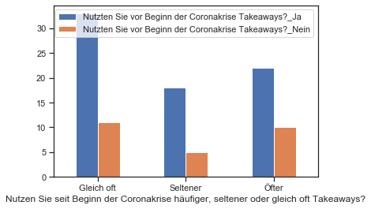
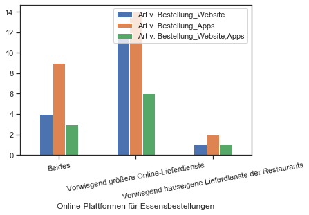

# Digitale-Wirtschaft-DDG-II
# Gliederung
1.  Einleitung
    - Motivation und Relevanz des Themas
    - Gründe für die Entscheidung und Entscheidungsprozess (-> Projektübersicht alt)
    - Begriffsglossar
    - Forschungsfrage
2.  Methode
    - Datenerhebung und Methodenauswahl
    - Bereitstellung der Materialien
    - Erklärung der Fragebögen
    - Erklärung der Analysemethoden
3.  Ergebnisse der Auswertung
    - Auswertung des Kundenfragebogens
    - Auswertung des Gastronomenfragebogens
4.  Fazit

# Einleitung

Bewirkte die Coronapandemie einen signifikanten Digitalisierungsschub in der Gastronomie?

### Motivation und Relevanz

Die Relevanz dieser Forschungsfrage zeigt sich im wissenschaftlichen Kontext vor allem im Hinblick auf die Untersuchung der gesellschaftlichen und wirtschaftlichen Effekte der Coronapandemie. Wie hat die Bevölkerung darauf reagiert, dass Restaurants für geraume Zeit schließen mussten? War man bereit nach digital unterstützten Alternativen zu suchen und wurden diese von Seiten der Gastronomen nun häufiger bereitgestellt? 
Auch aus wirtschaftlicher Perspektive ist das Thema relevant. Die Erforschung dieser Frage zeigt, ob eine Digitalisierung aufgrund der Pandemie als nötig und Gewinnbringend eingeschätzt wurde und wie sich dieser Wirtschaftsbereich digital angepasst hat. Daraus lassen sich nützliche Informationen ziehen, die für die Bewältigung ähnlich kritischer Situationen genutzt werden können.
Nicht zuletzt hat die Befragung der Bevölkerung zu einem alltäglichen Thema in einer außergewöhnlichen Zeit auch einen historisch dokumentierenden Wert.

### Hergang der Themenwahl

Diese Forschungsfrage ist vom übergeordneten Thema "Digitale Wirtschaft" abgeleitet. Uns auf den Bereich der Gastronomie zu spezialiseren hatte haupsächlich den Grund, dass es ein greifbares und alltägliches Thema ist, zu dem im Rahmen unserer Möglichkeiten dieses Kurses auch eine angemessene Menge an Daten aufgetrieben werden kann. Weitere Gründe waren selbstverständlich unsere eigene Neugier zu diesem Thema und zuvor genannte generelle Relevanz dieses Themas für verschiedenste Bereiche.
Der erste Plan, sich auf die Erforschung des neuartigen Konzeptes der "Cloud Kitchen" zu beschränken, wurde aufgrund mangelnder Fakte- und Datenlage folglich auf den gesamten Bereich der Gastronomie erweitert. Der alte und erste Plan ist dennoch hier beigefügt. <link  href=""/>  

### Glossar
Zuerst sind ein paar der immer wieder aufgegriffenen Schlagworte dieses Berichtes zu klären.

(Essens-)Lieferdienst: Ein von individuellen Restaurant(ketten) oder restaurantunabhängigen Unternehmen angebotener Service, bei dem Sie ihr Essen online oder per Telefon bestellen können, welcher Ihnen ihr Essen vom Restaurant nach Hause oder an einen anderen vereinbarten Ort liefert 

Takeaway: Bei dieser Methode bestellen Sie sich das Essen entweder vor Ort oder aus der Distanz (online, Telefon), Sie müssen dieses Essen selber beim Restaurant abholen.

Kochbox: Bei einer Kochbox werden ihnen die Zutaten und auch zumeist das Rezept geliefert, das Essen kochen Sie sich dabei selber (z.B. HelloFresh).

Cloud-Kitchen/Dark-Kitchen/Ghost-Kitchen bezieht sich auf Restaurantmodelle, die ihre Speisen in separaten, zum Teil mit anderen Gastronomiebetrieben geteilten Räumlichkeiten (nicht im eigenen Restaurant) zum Mitnehmen oder Liefern zubereiten.

Diese Definitionen sind ebenso in den verwendeten Fragebögen zu finden.

# Methode

### Datenerhebung

Die Datenerhebung erfolgte in dieser Studie in Form zweier eigens konzipierter und anonym beantwortbarer Fragebögen, welche über Google Forms realisiert und per den Studienteilnehmern per Link zugänglich gemacht wurden.
Der erste Fragebogen richtet sich an Nutzer von Lieferdiensten und erfragt das Verhalten der Kunden, der zweite ist an die Gastronomen gerichtet und erforscht die Veränderung der digital unterstützten Angebote und Dienste in der Gastronomie.
Die Verbreitung dieser Fragebögen wurde privat per Mail, WhatsApp und Discord sowie durch die das Forum der Medieninformatik der Universität Regensburg durchgeführt.

### Gründe für die Wahl der Datenerhebungsmethode

Für diese Art der Datenerhebung haben wir uns aus verschiedenen umstandsbedingten Gründen entschieden. Onlinefragebögen sind in der aktuell nach wie vor anhaltenden Lockdownsituation und auch allgemein eine passende Methode um mit vergleichsweise wenig Aufwand eine breite Masse zu befragen. Das ist in unserem Fall besonders wichtig, da dies ein Thema ist, welches auf Kundenseite enorm viele Menschen im Alltag betrifft. Diese Masse kann nicht durch wenige ausgewählte Personen vertreten werden. Es aufgrund der Kontaktbeschränkungen nicht möglich, viele Menschen physisch anzutreffen und die Zeit für diese Forschung eng begrenzt. 
Ebenso ist die Beantwortung der Fragebögen zeitlich von uns selbst unabhängig. Die Testpersonen können die Bögen ausfüllen wann sie wollen und können, was und noch mehr Flexibilität und mehr Antworten erbracht hat. 
Ein weiterer Grund für die Wahl der Datenerhebung war die Vermeidung von Datenschutzproblemen. Der Datenschutz wurde über die vollkommen anonyme Gestaltung der Fragebogen garantiert.
Eine Auswertung anhand bereits existierender Arbeiten und Daten war mangels Forschungsarbeiten und zuverlässiger Quellen zu diesem sehr speziellen und neuen Forschungsgebiet ebenso nicht lohnend.

### Detailliertere Beschreibung der Fragebögen:

Beide Bögen bestehen jeweils aus einem ersten Abschnitt zu demographischen Angaben des Studienteilnehmers, einem Teil mit Grundfragen zum Thema Lieferdienste, Takeway, Bestellmethoden etc. und einem abschließenden Teil zur Beurteilung Themenbezogener Aussagen in Form von Likert-Items.
Während der Kundenfragebogen im Hauptteil Fragen zur Nutzung von Lieferdiensten, Takeaway und anderen Digitalisierungsaspekten der Gastronomieangebote stellt, befasst sich der Gastronomenfragebogen mit Fragen zum Angebot digitalisierter Angebote in der Gastronomie. Zusätzlich werden im Kundenfragebogen Daten zum Konzept Kochboxen erfasst, während der Gastronomenfragebogen stattdessen das ebenso neue Konzept der Cloudkitchen aufnimmt. 
Grundsätzlich sind die Fragen im Hauptteil sind meist in Paare zu gruppieren. Es wird zuerst der Zustand vor der Pandemie, dann der jetzige Zustand abgefragt, um eine mögliche Veränderung zu erfassen. In Einzelfällen wird noch nach einer Einschätzung für die Zukunft gefragt.

Die beiden Fragebögen sind hier im PDF-Format <link href="https://github.com/marcfloeter/Digitale-Wirtschaft-DDG-II/blob/main/Kundenfragebogen.pdf"/> und hier <link  href="https://github.com/marcfloeter/Digitale-Wirtschaft-DDG-II/blob/main/Gastronomenfragebogen.pdf"/> in Google Forms zu finden.

### Auswertungsmethoden

Zur weiteren Auswertung wurde neben der deskriptiven Auswertung auch eine mehrfache lineare Regression verwendet. Das Ziel der Verwendung dieser Methode ist es, um herauszufinden, ob ein Faktor aus Bereich Digitalisierungsschub wegen Coronapandemie die Nutzungshäufigkeit des Online-Lieferdiensts beeinflusst. Die Nullhypothese dieser Studie lautet, dass alle Faktorenkoeffizienten, welche aus Bereich Digitalisierung seit Coronakrise stammen, einen Wert von 0 haben. Wenn es nur einen Faktor aus diesem Bereich gibt, dessen seinen Koeffizientenwert ungleich 0 ist, kann geschlossen werden, dass die Nullhypothese verworfen und die Alternativhypothese akzeptiert wird. Die Regressionsanalyse ist eine übliche Methode zur Vorhersage. Sie wird immer dann verwendet, wenn wir einen kausalen Zusammenhang zwischen Variablen haben. Die Häufigkeit der Nutzung von Online-Lieferservice ist die abhängige Variable in dieser Methode.

# Ergebnisse der Auswertung
## Kundenforschung

### Erfasste Demographische Daten ###

Parameter | Resultat
--- | ---
n | 102 Befragte
Geschlecht | Weiblich: 62; männlich: 38; keine Angabe: 2
Altersskala der Teilnehmenden | 19-66 Jahre (Altersdurchschnitt: 27,36)
Abschluss | 40,2% Bachelor, 28,4% Abitur, 19,6% Master; 1% Doktor oder Höher; 4,9% Hauptschulabschluss; 1% Mittlere Reife; 4,9% Abgeschlossene Berufsausbildung 
Anzahl der Kinder | Keine: 83,3%; Eins:  6,9%, Zwei: 6,9%; Vier: 2%; keine Angabe: 1%
Beschäftigungsstatus | 60,8% Student/Schüler; 28,4% Vollzeit ; 3,9% Teilzeit; 3,9% Selbstständig; 2% Arbeitslos; 1% Rente
Monatliche Ausgaben für Lebensmittel | €0 bis €2500 (Durschschnittliche Ausgaben: €327,27)
Arbeitsmodus seit der Beginn der Coronakrise | 58,8%: Homeoffice ; 26,5%: abwechselnd vor Ort und im Homeoffice, 14,7% :vor Ort

### Analyse der Daten ###

![Abbildung 1. Vergleich der Nutzungsintensität von Online-Essenlieferdienst vor und nach der Coronapandemie]

Aus Abbildung 1 ist ersichtlich, dass die Mehrheit der Befragten schon vor Beginn der Coronakrise Online-Lieferservices benutzen. Viele von ihnen haben seit Beginn der Coronapandemie Lieferservices häufiger in Anspruch genommen, aber ein Großteil der Intensität der Lieferdienstnutzung änderte sich nach dem Start von Coronapandemie nicht.
In der Gruppe der Probanden, die vor der Coronakrise keine Lieferservices in Anspruch nahmen, begannen viele von ihnen mit der Nutzung von Lieferservices als die Krise begann. 
Die meisten von ihnen nutzen jedoch trotz der Pandemie weiterhin keine Lieferservices.

![Vergleich der Nutzungsintensität von Takeaways vor und nach der Coronapandemie]

Auf der zweiten Abbildung ist erkennbar, dass die Mehrheit der Befragten bereits vor der Coronapandemie Takeaways benutzt hat. Die Häufigkeit ihrer Nutzung ist sowohl vor als auch seit Beginn der Coronapandemie zum großen Teil weitgehend unverändert. In der Zwischenzeit ist die Hälfte der Befragten, die vor Coronakrise keine Takeaways genutzt haben, seit Pandemiebeginn auf diesen Service umgestiegen. Fast alle Befragten bevorzugen lieber Takeaway als Lieferdienste für ihre Essenbestellung. Wenn sie Takeaway verwendet haben, ist es meistens weniger wahrscheinlich, dass Online-Essenlieferservice verwendet werden (vgl. hierzu Abbildung 3).

![Vergleich zwischen der Intensität monatlicher Nutzung von Lieferdienst gegen Takeaway anhand aller Befragten]

Abbildung 4. Vergleich den Arten von Online-Lieferservices und den Arten von Plattformen, die bei der Online-Essenbestellung am häufigsten verwendet werden.

Aus der vierten Abbildung ist ersichtlich, dass größere Online-Lieferdienste (z.B Lieferando, Bring Butler, Lieferhase, usw.) hauptsächlich zur Bestellung genutzt werden . Die meisten Befragten verwenden  Apps , wenn sie ihr Essen über diese Art von Lieferservice bestellen, aber nicht wenige bestellen auch über die Webseite. Wenn die Befragten  sowohl größere Lieferservices als auch die hauseigenen Lieferdienst der Restaurants verwenden (z.B McDelivery, Domino’s Pizza Germany, Vapiano Lieferservice, usw.), ist die Bestellung per App die am häufigsten genutzte Variante.

Abbildung 5. Vergleich der Nutzungsintensität der Plattform bei der Essenbestellung und der Zahlungsmethoden.

Die Mehrheit der Befragten, die bei der Essenbestellung gerne Apps verwenden, hat auf bargeldlose Bezahlung umgestiegen (Abbildung 5). In der Zwischenzeit bevorzugen die meisten Befragten, die ihr Essen lieber telefonisch, vor Ort oder per Website bestellen, immer noch die Kombination von bargeldlose Bezahlung und Bargeld bei ihrer Transaktionen.
Die Hälfte unserer Befragten bestellte seit der Coronapandemie häufiger Essen über das Internet. Mehr als 80% davon bestellen ihr Essen zum Abendessen. Mehr als 40% der Befragten sind nach der Lockerung der Coronamaßnahmen im späten Frühling 2020 wieder häufiger ins Restaurant gegangen anstatt Essen zu bestellen, aber nicht wenige von ihnen bestellen trotz Essen mit Lieferservice, obwohl sie ins Restaurant gegangen sind. Fast alle Befragten wollen nach der Coronapandemie wieder häufiger ins Restaurants. Allerdings glaubt mehr als die Hälfte von ihnen, dass die Nutzung der Lieferdienste während der Coronapandemie einen dauerhaften Effekt auf das Konsumverhalten im Bereich Gastronomie haben wird. Abgesehen von Liefer- und Takeawaydiensten gibt es auch Kochboxdienst, aber die meisten von Befragten sind immer noch zögerlich, sie zu nutzen.

### Nutzungsmotivation von Lieferdienst, Kochbox und Takeaways ###

Bequemlichkeit und Zeitersparnis sind die Hauptgründe, warum Benutzer von Online-Essenlieferdiensten ihr Essen über diese Dienste bestellen (Abbildung 6). Unsere Befragten stammen aus der produktiven Altersgruppe mit einem Durchschnittsalter von 27,36 Jahren. Darüber hinaus arbeiten die meisten von ihnen als Studenten und vollzeitangestellte Mitarbeiter. Daher verbringen sie ihre Zeit meistens zu arbeiten oder zu studieren, anstatt Essen zu kochen. Aus der dritten Abbildung geht hervor, dass die meisten Befragten die Verwendung von Takeaways gegenüber Lieferservices bevorzugen. Wenn sie jedoch keine Zeit haben, ihr Essen abzuholen, ist ein Lieferservice der beste Ersatz für das Problem. Der Grund für die Zeitersparnis ist wohl sinnvoll, wenn wir uns an diese Daten orientieren. Das Bestellen von Speisen ist zeitsparender als das Kochen ihrer eigenen Speisen. 80% der Befragten nutzen Lieferdienst, um beim Abendessen Essen zu bestellen. Dies erklärt, dass sich die Nutzung von Lieferservices bequem anfühlt, wenn sich die Befragten aufgrund täglicher und geschäftiger Aktivitäten müde fühlt, was dazu führt, dass es nicht möglich ist, Takeaways zu verwenden oder Essen selbst zu kochen. Außerdem bieten Online-Lieferservices viele Möglichkeiten zur Auswahl von Speisen, sodass die Nutzung dieses Dienstes eine Variation der Mahlzeit bietet. Seit der Coronapandemie haben die Befragten beim Einkauf ihres Lebensmittels nicht zu Zustelldienste (z.B. Kochbox) umgestiegen. Sie kaufen weiterhin in Supermärkten ein und glauben, dass die vorhandenen Gesundheitsprotokolle ausreichen, um die Übertragung des Virus zu verhindern.

### Mehrfache lineare Regression ###

VIF | Unabhängige Variable
--- | ---
3.298 | Monatliche Ausgabe für Lebensmittel
2.820 | Monatliche Nutzung von Takeaways
4.232 | Alter

Tabelle 2. Wenn der Wert von variance inflation factor (VIF) zwischen 1 und 5 liegt, ist die Multikolinearität in Ordnung

Bevor eine multiple lineare Regressionsanalyse durchgeführt wird, muss ein Test zur Überprüfung der Voraussetzungen mehrfachen linearen Regression durchgeführt werden. Wenn ein oder zwei Voraussetzungen verletzt würden, kann die Methode der multiplen linearen Regression weiterhin verwendet werden. Wenn jedoch mehr als zwei Voraussetzungan verletzt sind, ist es ratsam, eine andere Analysemethode zu verwenden (Clusteranalyse, logistische Regression, usw.). Die grafische Überprüfung des Voraussetzungstests zeigen, dass alle unabhängige Variablen, die kontinuerlich sind, eine lineare Beziehung mit der abhängige Variablen haben. Dieser Voraussetzungstest zeigt weiter an, dass Fehlerterm normal verteilt ist und es keine Autokorrelation von Fehlerverteilung gibt. Allerding gibt es eine Heteroskedastizität der Residuen. Es scheint, dass es keinen Unterschied in der Häufigkeit der Nutzung von Lieferdienst zwischen Befragten gibt, die viel Geld pro Monat für Lebensmittel ausgeben, und Befragten, die wenig Geld ausgeben. Es gibt möglicherweise mehrere Essenvariabilität bei diejenigen, die mehr Geld pro Monat ausgeben (z.B.: Grillen, Fine Dining, Kochen, usw.). Es könnte auch Endogenität geben, wobei viele Befragten, die wenig Geld pro Monat für Lebensmittel ausgeben, relativ viele Lieferdienste im Monat benutzten. In diesem Kontext müssen wir darauf achten, dass unsere Befragten hauptsächlich Studenten sind und das Durchschnittsalter 27 Jahre beträgt. Im Fragebogen wurde leider nicht gefragt, ob sie alleine, mit Partner, Freunden, oder ihrer Familie wohnen. Es kann eine Kovarianz geben, dass die Gebühr von Lieferdienstbestellungen nicht direkt durch die Befragte bezahlt wurden, sondern durch Familienmitglied, das bei ihnen zusammen wohnt. Schließlich gibt es keine Prädiktoren, die von den anderen Prädiktoren hoch representiert werden (keine Multikolinearität, vgl. Tabelle 2).

Der Wert von R-Square beträgt 0,842, was bedeutet, dass alle Faktoren bis zu 84,29% der Variabilität in der Häufigkeit der Nutzung von Lieferdienst erklären können. Bei Sozialwissenschaften ist 80% Varianzerklärung sehr ausgezeichnet. Der Achsenabschnitt von -0,491 zeigt an, wenn die Befragte in allen Faktoren den Wert 0 besitzen, nutzen sie gar keine Lieferservices im Monat.

## Gastronomenforschung ##
### Demographische Angaben ###
Parameter | Resultat
--- | ---
n | 4 Befragte
Gründungsjahr | 2003: 3 Restaurants; 2009: 1 Restaurant
Art des Restaurants | Familienrestaurant: 4
Speisekategorie | Indonesisch/Thailändisch: 3 ; Amerikanisch: 1 
Lage des Restaurants - Stadt | Hamburg: 3 ; Regensburg: 1 
Lage des Restaurants - regionales Umfeld | Stadtgebiet: 4
Kapazitäten für Gäste | 51-75 Gäste: 3 Restaurants; 26-50: 1 Restaurant

### Digitalisierung innerhalb der Gastronomie ### 

Bei der Frage der Digitalisierung ist bei den hier aufgeführten Teilnehmenden Restaurants erkennbar, dass alle Teilnehmenden eine eigene Website besitzen und auch schon vor dem Ausbruch der Coronapandemie über eine eigene Website verfügten. Bezüglich der verfügbaren Möglichkeiten bietet nur einer der Teilnehmern seinen Kunden keine Möglichkeit ihr Essen schon im Voraus zu bestellen, um es dann im Restaurant vor Ort zu konsumieren.

Von den Bezahlmöglichkeiten bieten alle 4 Teilnehmern ihren Kunden alle verfügbaren Möglichkeiten an (Bar, mit Karte, Kontaktlos und per Online/Überweisung). Verglichen mit der Zeit vor Corona ergibt sich hierbei eine Veränderung/Erweiterung mit den Zahlungsmöglichkeiten. Vor der Coronakrise akzeptierten zwar alle 4 Restaurants Barzahlung, aber nur 3 der Restaurants boten die anderen Zahlungsvarianten an.

Im Vergleich dazu ist bei der Mitgliedschaft bei einem Lieferdienst keine Veränderung feststellbar. Sowohl laut Stand der Befragung als auch vor der Coronapandemie waren 3 der Restaurants bei einem Liederdienst Registriert und sind es weiterhin, 1 Restaurant war hingegen vor der Krise bei keinem Lieferdienst registriert und war auch zum Zeitpunkt der Befragung bei keinem Lieferdienst registriert

Von dem Angebot der Hauseigenen Lieferdienste ist erkennbar, dass es zu keiner Veränderung bei allen Beteiligten gekommen ist, da alle 4 Restaurants bereits vor der Coronakrise einen hauseigenen Lieferdienst angeboten haben und auch weiterhin einen hauseigenen Lieferdienst anbieten.
Im Direkten Vergleich mit Takeaway ergibt sich keine Konkurrenz der beiden Konzepte, da hier  alle teilnehmenden Restaurants sowohl einen Takeaway-Service besitzen, als auch schon vor der Coronakrise einen solchen Dienst angeboten haben.

Bei der verwendeten Bestellmethode hingegen ergeben sich deutliche Unterschiede. Bei Lieferdiensten ist die am häufigsten genutze Bestellmethode die Bestellung per Telefon (Bei allen 4 Restaurants), gefolgt von Restauranteigenen Websiten und Apps (Jeweils 3 Restaurants). Die gar nicht genutzte Option ist die Bestellung über die Website eines großen Online-Lieferdienster, keiner der Teilnehmer benutzt diese Option. Anders hingegen sieht es bei Takeaways aus, hierbei sind die am häufigsten genutzten Methoden die Bestellung vor Ort und per Telefon (jeweils 4 Restaurants), gefolgt von der Restauranteigenen Website (3 Restaurants). Dadurch das alle Beteiligten Lieferdienste und Takeaways anbieten ergeben sich logischerweise keine Angaben zu den Optionen "Wir bieten keinen Lieferdienst/Takeaways an".

Bei der Frage nach der Nutzung des Cloud-Kitchen Konzeptes ergibt sich eine deutliche Antwort, da alle 4 Beteiligten sich nicht vorstellen können so ein derartiges Konzept zu benutzen.

### Motivation für die Entwicklungen ###

Insgesamt lässt sich bei der Motivation für die Nutzung von Lieferdiensten feststellen, dass Lieferdienste für manche Betreiber durchaus eine Möglichkeit darstellen können mehr Kunden für ihr Geschäft zu gewinnen, dies allerdings nicht zwangsläufig erfolgreicher ist als das anbieten von Takeaway.

Bei der Restlichen Motivation ergibt sich eine deutliche Diskrepanz bezüglich des Inputs. 3 der 4 Beteiligten stimmen vielen der gefragten Punkte vollumfänglich zu, während der verbliebene Beteiligte die meisten Fragen gar nicht übereinstimmt.

Eine Übereinstimmung, welche bei allen Beteiligten anzutreffen ist, ist die Nicht-zustimmung auf  die Aussagen, dass Lieferdienste Angeboten werden, weil die betreffenden Produkte nicht vor Ort/Im Restaurant bestellbar ist.

Hingegen bei Takeaways ergibt sich ein verändertes Bild. Alle Beteiligten sind hierbei der Ansicht, dass sich durch Takeaway-Angebote mehr Kunden gewinnen lassen, sowohl insgesamt als auch im Vergleich zu Lieferdiensten.

# Fazit

