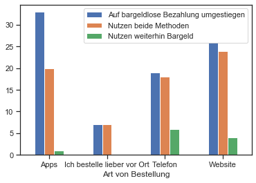
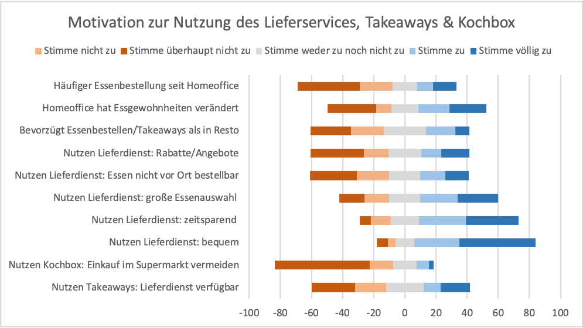

# Digitale-Wirtschaft-DDG-II
# Gliederung
1.  Einleitung
    - Motivation und Relevanz des Themas
    - Gründe für die Entscheidung und Entscheidungsprozess (-> Projektübersicht alt)
    - Begriffsglossar
    - Forschungsfrage
2.  Methode
    - Datenerhebung und Methodenauswahl
    - Bereitstellung der Materialien
    - Erklärung der Fragebögen
    - Erklärung der Analysemethoden
3.  Ergebnisse der Auswertung
    - Auswertung des Kundenfragebogens
    - Auswertung des Gastronomenfragebogens
4.  Fazit

# Einleitung
# Methode
# Ergebnisse der Auswertung
## Kundenforschung

### Erfasste Demographische Daten ###

Parameter | Resultat
--- | ---
n | 102 Befragte
Geschlecht | Weiblich: 62; männlich: 38; keine Angabe: 2
Altersskala der Teilnehmenden | 19-66 Jahre (Altersdurchschnitt: 27,36)
Abschluss | 40,2% Bachelor, 28,4% Abitur, 19,6% Master; 1% Doktor oder Höher; 4,9% Hauptschulabschluss; 1% Mittlere Reife; 4,9% Abgeschlossene Berufsausbildung 
Anzahl der Kinder | Keine: 83,3%; Eins:  6,9%, Zwei: 6,9%; Vier: 2%; keine Angabe: 1%
Beschäftigungsstatus | 60,8% Student/Schüler; 28,4% Vollzeit ; 3,9% Teilzeit; 3,9% Selbstständig; 2% Arbeitslos; 1% Rente
Monatliche Ausgaben für Lebensmittel | €0 bis €2500 (Durschschnittliche Ausgaben: €327,27)
Arbeitsmodus seit der Beginn der Coronakrise | 58,8%: Homeoffice ; 26,5%: abwechselnd vor Ort und im Homeoffice, 14,7% :vor Ort

### Analyse der Daten ###

Abbildung 1. Vergleich der Nutzungsintensität von Online-Essenlieferdienst vor und nach der Coronapandemie.

Aus Abbildung 1 ist ersichtlich, dass die Mehrheit der Befragten schon vor Beginn der Coronakrise Online-Lieferservices benutzen. Viele von ihnen haben seit Beginn der Coronapandemie Lieferservices häufiger in Anspruch genommen, aber ein Großteil der Intensität der Lieferdienstnutzung änderte sich nach dem Start von Coronapandemie nicht.
In der Gruppe der Probanden, die vor der Coronakrise keine Lieferservices in Anspruch nahmen, begannen viele von ihnen mit der Nutzung von Lieferservices als die Krise begann. 
Die meisten von ihnen nutzen jedoch trotz der Pandemie weiterhin keine Lieferservices.

Vergleich der Nutzungsintensität von Takeaways vor und nach der Coronapandemie.

Auf der zweiten Abbildung ist erkennbar, dass die Mehrheit der Befragten bereits vor der Coronapandemie Takeaways benutzt hat. Die Häufigkeit ihrer Nutzung ist sowohl vor als auch seit Beginn der Coronapandemie zum großen Teil weitgehend unverändert. In der Zwischenzeit ist die Hälfte der Befragten, die vor Coronakrise keine Takeaways genutzt haben, seit Pandemiebeginn auf diesen Service umgestiegen. Fast alle Befragten bevorzugen lieber Takeaway als Lieferdienste für ihre Essenbestellung. Wenn sie Takeaway verwendet haben, ist es meistens weniger wahrscheinlich, dass Online-Essenlieferservice verwendet werden (vgl. hierzu Abbildung 3).

Vergleich zwischen der Intensität monatlicher Nutzung von Lieferdienst gegen Takeaway anhand aller Befragten.

Abbildung 4. Vergleich den Arten von Online-Lieferservices und den Arten von Plattformen, die bei der Online-Essenbestellung am häufigsten verwendet werden.

Aus der vierten Abbildung ist ersichtlich, dass größere Online-Lieferdienste (z.B Lieferando, Bring Butler, Lieferhase, usw.) hauptsächlich zur Bestellung genutzt werden . Die meisten Befragten verwenden  Apps , wenn sie ihr Essen über diese Art von Lieferservice bestellen, aber nicht wenige bestellen auch über die Webseite. Wenn die Befragten  sowohl größere Lieferservices als auch die hauseigenen Lieferdienst der Restaurants verwenden (z.B McDelivery, Domino’s Pizza Germany, Vapiano Lieferservice, usw.), ist die Bestellung per App die am häufigsten genutzte Variante.

Abbildung 5. Vergleich der Nutzungsintensität der Plattform bei der Essenbestellung und der Zahlungsmethoden.

Die Mehrheit der Befragten, die bei der Essenbestellung gerne Apps verwendet, ist auf bargeldlose Bezahlung umgestiegen (Abbildung 5).Die meisten Befragten, die ihr Essen lieber telefonisch, vor Ort oder per Website bestellen, bevorzugen immer noch die Kombination von bargeldlose Bezahlung und Bargeld bei ihrer Transaktionen.
Die Hälfte unserer Befragten bestellte seit der Coronapandemie häufiger Essen über das Internet. Mehr als 80% davon bestellen ihr Essen zum Abendessen. Mehr als 40% der Befragten sind nach der Lockerung der Coronamaßnahmen im späten Frühling 2020 wieder häufiger ins Restaurant gegangen anstatt Essen zu bestellen, aber nicht wenige von ihnen bestellen trotzdem  per Lieferservice, obwohl sie ins Restaurant gegangen sind. Fast alle Befragten wollen nach der Coronapandemie wieder häufiger ins Restaurant. Allerdings glaubt mehr als die Hälfte von ihnen, dass die Nutzung der Lieferdienste während der Coronapandemie einen dauerhaften Effekt auf das Konsumverhalten im Bereich der Gastronomie haben wird. Abgesehen von Liefer- und Takeawaydiensten gibt es auch Kochboxdienste, aber die meisten  Befragten zögern so eine Art von Dienst zu benutzen.

### Nutzungsmotivation von Lieferdienst, Kochbox und Takeaways ###

Bequemlichkeit und Zeitersparnis sind die Hauptgründe, warum Benutzer von Online-Essenlieferdiensten ihr Essen über diese Dienste bestellen (vgl.Abbildung 6). Unsere Befragten stammen aus der produktiven Altersgruppe mit einem Durchschnittsalter von 27,36 Jahren. Darüber hinaus arbeiten die meisten von ihnen als Studenten und/oder vollzeitangestellte. Daher verbringen sie ihre Zeit meistens damit  entweder zu arbeiten oder zu studieren, anstatt Essen zu kochen. Aus der dritten Abbildung geht hervor, dass die meisten Befragten die Verwendung von Takeaways gegenüber Lieferservices bevorzugen. Wenn sie jedoch keine Zeit haben, ihr Essen abzuholen, ist ein Lieferservice der beste Ersatz für das Problem. Der Grund für die Zeitersparnis ist wohl sinnvoll, wenn wir uns an diese Daten orientieren. Das Bestellen von Speisen ist zeitsparender als das Kochen  eigener Speisen. 80% der Befragten nutzen Lieferdienst, um für das  Abendessen etwas zu bestellen. Dies erklärt, dass sich die Nutzung von Lieferservices bequem anfühlt, wenn sich die Befragten aufgrund täglicher und geschäftiger Aktivitäten müde fühlen, was dazu führt, dass es nicht möglich ist, Takeaways zu verwenden oder Essen selbst zu kochen. Außerdem bieten Online-Lieferservices viele Möglichkeiten zur Auswahl von Speisen, sodass die Nutzung dieses Dienstes eine Variation der Mahlzeit bietet.

## Gastronomenforschung ##
### Demographische Angaben ###
Parameter | Resultat
--- | ---
n | 4 Befragte
Gründungsjahr | 2003: 3 Restaurants; 2009: 1 Restaurant
Art des Restaurants | Familienrestaurant: 4
Speisekategorie | Indonesisch/Thailändisch: 3 ; Amerikanisch: 1 
Lage des Restaurants - Stadt | Hamburg: 3 ; Regensburg: 1 
Lage des Restaurants - regionales Umfeld | Stdatgebiet: 4
Kapazitäten für Gäste | 51-75 Gäste: 3 Restaurants; 26-50: 1 Restaurant

# Fazit

